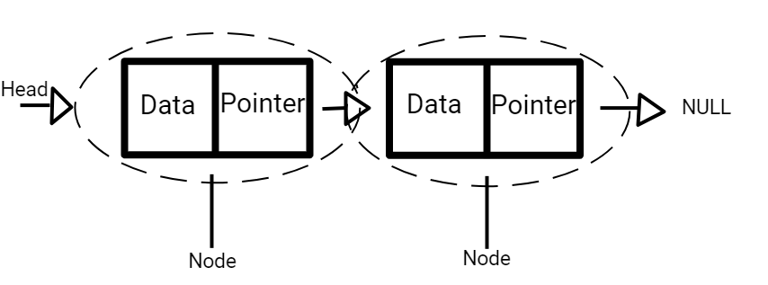
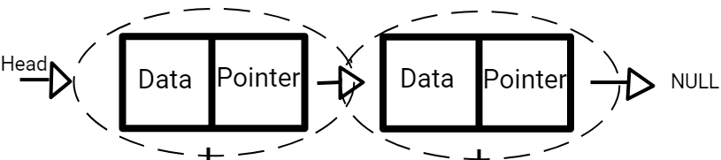
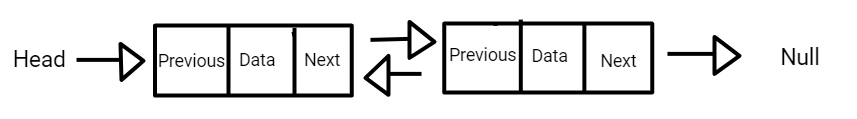
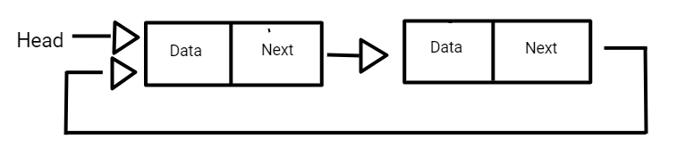

# Linked Lists

Linked lists is a data structure that is used to organize and store a collection of elements called nodes. These nodes are not stored in one specific place but are linked together. A linked list is a series of connect nodes where each node stores its own data 4 and the address of the next node so it can pass information along.

Some common real life examples of Linked Lists include:

- A web browser's previous and next web page URLS are linked to each other through the buttons
- In your phone, your contacts' details will be placed in alphabetical order due to a linked list being set to contact in the correct position.
- The redo and undo buttons in a document page are double linked lists. You can uses the undo button or Ctrl+Z to modify your document.


#### <ins>Advantages


Every data structure has its own advantages. Some advantages of Linked lists are:

- Linked lists can grow and shrink as much as they want, depending on the memory.
- Adding and removing nodes for a linked list is very easy, especially if the list is large
- Linked lists can be easy modified by inserting and deleting information 
- In a case of frequent insertion or deletion, linked lists handle it better. 


#### <ins>Disadvantages

No data strucutre is perfect and all have their own disadvantages as well.

- Linked lists require additional memory because of the connection between each nodes
- Linked lists can't access random elements. In order to reach a specific node, you need to traverse the entire list from the start to finish.


## Basic Definitions

- **Node Structure:** A node in a linked lists that contatins two components
- **Data:** The value assossiated with the node
- **Pointer:** Stores the memory address to the next node
- **Head and Tail:** The head node points to the first not in the list, the last node in the list points to the Tail which is the `NULL` node. 


 


## Basic Operations

Linked Lists have 3 basic operations, `Insertion`, `Deletion`, and `Searching`.


#### <ins>Insertion

Insertion is the process of adding a new node to a linked list. It involves adjusting the pointers of the existing nodes to keep the proper order. Insertion can be done at the beginning, end, or middle of the list.

```csharp
// Inserts a new Node at the front of the list. 

public void push(int new_date)
{
    //Create the new node and put in the data 
    Node new_node = new Node(new_data);

    // Makes the 'next; pointer of the new node to the current head of the list 
    new_node.next = head;

    // Moves the Head to point at the new node 
    head = new_node;

    //To add a node to the end of the list use: append(int new_data)
    // To add a node to the end of the list use: insertAfter(Node prev_node, int new_data)
}

```


#### <ins>Deletion

Deletion removes a node from the linked list and also requires adjusting pointers of the nodes next to it so that the order is still correct. Just like `Insertion`, it can be at the beginning, middle, or end of the list.

###### Delete from Beginning
```csharp
public void DeleteNode(int Key) 
{
    //Store head node 
    Node temp = head, prev = null;

    // If the head node holds the key to be deleted 
    if (temp != null && temp.Dada == key)
    {
        head = temp.Next; // Change head
        return;
    }

    //Search for the key to be deleted, keep track of the previous mode
    //as we need to change temp.Next
    while (temp != null && temp.Data != key)
    {
        prev = temp;
        temp = temp.Next;
    }

    //If key was not present in the linked list
    if (temp == null) return;

    //unlink the node from the linked list
    prev.Next = temp.Next;
}

```
What Happens in this Code?
1) The code checks if the head node contains the key that is being deleted
2) If no, it looks through the list, keeps track of the current node (`temp`) and the previous node (`prev`)
3) If it find the node with the key, it updates the previous node's `Next` address to skip the node with the key
4) If the node with the key is not found, the method exits without changing anything

With this method, the code looks for the node with the `key`. This node can be at the beginning, middle or end of the List. 


#### <ins>Searching

In order to find a specific value in a Linked list, you much go through the head node until the value is found or the end of the list is reached.

```csharp
 
/* Link list node */
class Node {
    public int key;
    public Node next;
};
 
class Program {
    /* Given a reference (pointer to pointer) to the head
    of a list and an int, push a new node on the front
    of the list. */
    static void push(ref Node head_ref, int new_key)
    {
        
        Node new_node = new Node();
 
        // put in the key 
        new_node.key = new_key;
 
        //link the old list of the new node 
        new_node.next = head_ref;
 
        //move the head to point to the new node 
        head_ref = new_node;
    }
 
    static void Main(string[] args)
    {
        // Start with the empty list 
        Node head = null;
        int x = 21;
 
        // Use push() to construct below list
        //14->21->11->30->10 
        push(ref head, 10);
        push(ref head, 30);
        push(ref head, 11);
        push(ref head, 21);
        push(ref head, 14);
 
        List<int> v = new List<int>();
        Node temp = head;
        while (temp != null) {
            v.Add(temp.key);
            temp = temp.next;
        }
 
        //Find whether x is present in the list or not 
        // This is the Searching portion of the code
        if (v.Contains(x)) {
            Console.WriteLine("YES");
        }
        else {
            Console.WriteLine("NO");
        }
    }
}

```

## Types of Linked Lists

There are three primary types of Linked Lists: Singly, Doubly, and Circular.

### Singly Linked List

This is a straight line where one node leads to the next.




### Doubly Linked List

In this type of list, each node has a reference to the previous, and next node. This allows the information to go forward and backward. 




### Circular Linked List

In this list, the last Node points to the Head node creating a loop.



## Efficency

Queue has a Big "O" notation of O(n). What this means is that the time it takes grows linearly with the size of the input. So the bigger the data size, the longer it will take for the code to proccess the information.

.png)

## Example: Music Player Playlist

In the example below, we will write a simple code that will create a playlist management system. This will use a singly linked list. Each song is represented by a node which contatins the tiele and artist of the song.

Some things to remember:

- Each node needs to include the title, artist and the `Next` to the next song in the playlist
- Playlist should have operations such as:
    - Add Song
    - Remove Song
    - Display Playlist

```csharp
// Node class for the song
class SongNode
{
    public string Title;
    public string Artist;
    public SongNode Next;

    public SongNode(string title, string artist)
    {
        Title = title;
        Artist = artist;
        Next = null;
    }
}
// Playlist class using a singly linked list
class Playlist
{
    private SongNode head;

    // Method to add a song to the end of the playlist
    public void AddSong(string title, string artist)
    {
        SongNode newSong = new SongNode(title, artist);

        if (head == null)
        {
            head = newSong;
        }
        else
        {
            SongNode current = head;
            while (current.Next != null)
            {
                current = current.Next;
            }
            current.Next = newSong;
        }
    }
    // Method to remove a song from the playlist
    public void RemoveSong(string title)
    {
        if (head == null)
        {
            Console.WriteLine("Playlist is empty. No song to remove.");
            return;
        }

        if (head.Title == title)
        {
            head = head.Next;
            return;
        }
        SongNode current = head;
        SongNode prev = null;
        while (current != null && current.Title != title)
        {
            prev = current;
            current = current.Next;
        }

        if (current == null)
        {
            Console.WriteLine("Song '" + title + "' not found in playlist.");
        }
        else
        {
            prev.Next = current.Next;
        }
    }
    // Method to display all songs in the playlist
    public void DisplayPlaylist()
    {
        if (head == null)
        {
            Console.WriteLine("Playlist is empty.");
            return;
        }

        Console.WriteLine("Current Playlist:");

        SongNode current = head;
        while (current != null)
        {
            Console.WriteLine("Title: " + current.Title + ", Artist: " + current.Artist);
            current = current.Next;
        }
    }
}
// Main program to demonstrate playlist management
class Program
{
    static void Main(string[] args)
    {
        Playlist myPlaylist = new Playlist();

        // Adding songs to the playlist
        myPlaylist.AddSong("Shape of You", "Ed Sheeran");
        myPlaylist.AddSong("Believer", "Imagine Dragons");
        myPlaylist.AddSong("Someone Like You", "Adele");

        // Display the current playlist
        myPlaylist.DisplayPlaylist();

        // Remove a song from the playlist
        myPlaylist.RemoveSong("Believer");

        // Display the updated playlist
        myPlaylist.DisplayPlaylist();
    }
}

```
Notice the several different classes are used. This is a great way to keep your code organized and makes it easier to connect your code together in the end.


## Problem to Solve: Managing Webpages

You are tasked with implementing a webapge management system for a browser's history using a double linked list. Each webpage visited is represented by a node in the doubly linked list.

#### Task

1) Each node should contain the following fields
    - Url
    - Title of webpage
    - `Next` to the next webpage
    - `Previous` to a previous webpage
2) Add a newly visited webpage to the end of history
3) Be able to navigate back to the previous webpage in history
4) Go to the next webpage in history
5) Display all webpages in history


An example of how the input and output would look is this:

```
Webpage History:
Title: Google, URL: https://www.google.com
Title: Wikipedia, URL: https://www.wikipedia.org
Title: GitHub, URL: https://www.github.com

history.Back();

After going back:
Webpage History:
Title: Google, URL: https://www.google.com
Title: Wikipedia, URL: https://www.wikipedia.org

history.Forward();

After goin forward:
Webpage History:
Title: Google, URL: https://www.google.com
Title: Wikipedia, URL: https://www.wikipedia.org
Title: GitHub, URL: https://www.github.com
```

You can check your code with the solution here: [Solution](Linked-Lists)

[Back to Welcome Page](0-welcome.md)


